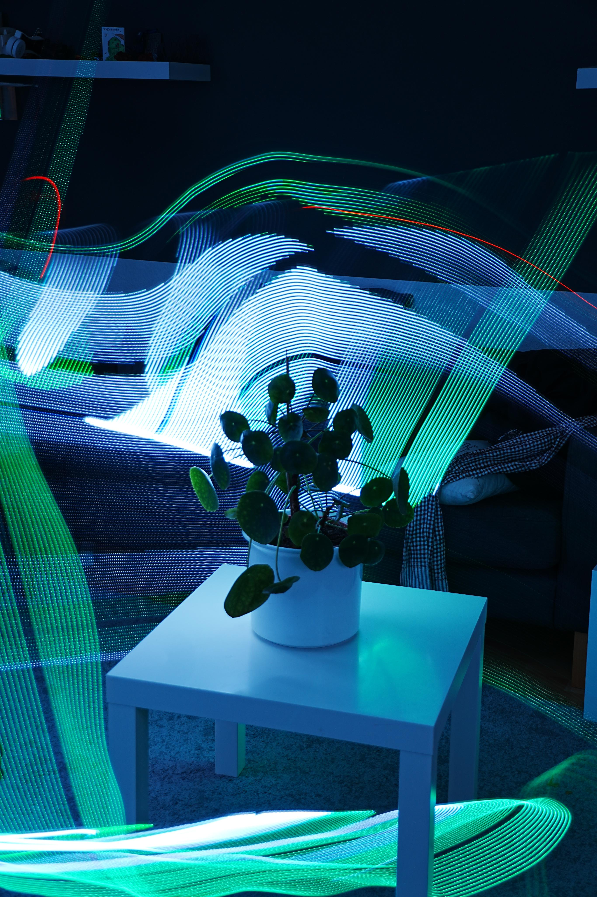
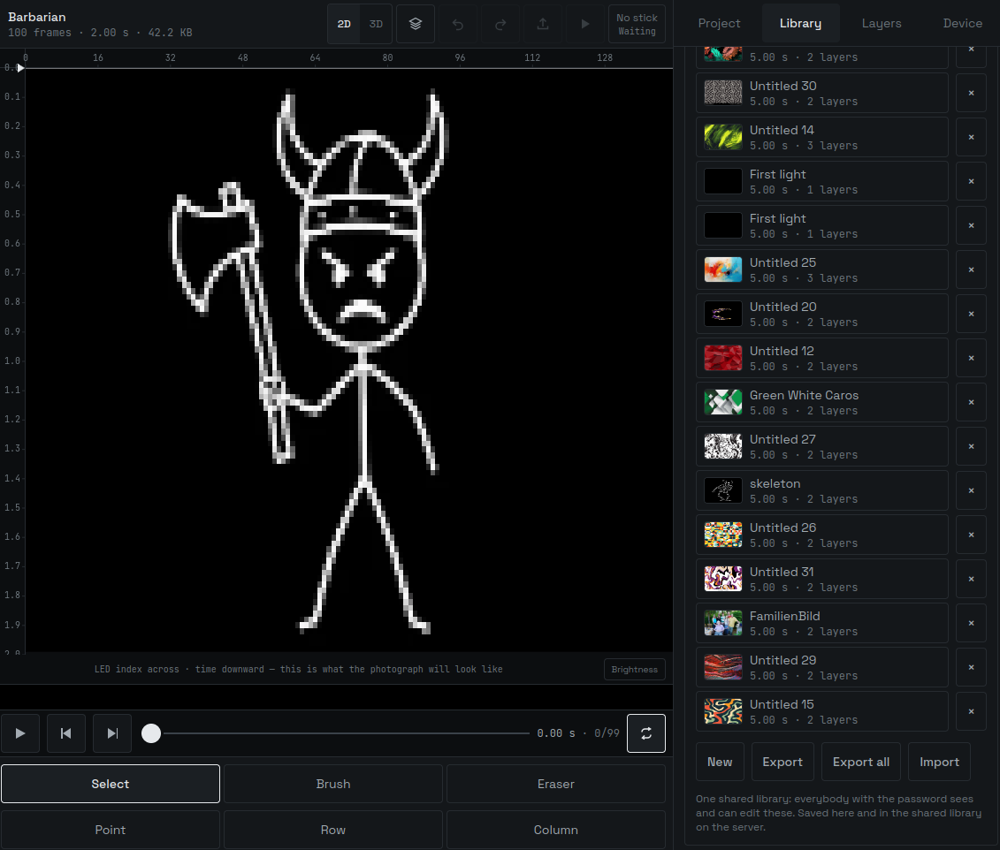

# Light Painting Stick




A 1 m addressable LED bar for long-exposure light painting. Animations are designed
in a browser, sent to an ESP32 over WiFi, held in RAM, and played back on a button
press while the camera shutter is open.

The editor's canvas is a **preview of the photograph**: X is LED index, Y is time.
Sweep the stick sideways at constant speed with the shutter open and the image on
the sensor is the canvas. There is no separate preview mode, because the thing
being edited is the output.

```
   browser  ──wss──▶  server  ◀──wss──  ESP32
   (web/)             (server/)         (firmware/)
   design, mix,       relay, static      play bytes
   gamma-correct      hosting, library
```

All interpolation, colour maths and gamma happen in the browser. The firmware is a
dumb player: it receives fully-rendered RGB frames and clocks them out.

**The relay is forced, not chosen.** A page served over HTTPS cannot open a socket
to an ESP32 on the local network — `ws://` is mixed content, `wss://` needs a
certificate the device cannot have, and Private Network Access rules block
HTTPS → private IP regardless. So the device dials *out* to the server and the
browser meets it there. The upside is that it works on any browser, needs no port
forwarding, and behaves the same on a home network as on a phone hotspot. The
downside is that no internet means no shooting.

| Document | Contents |
|---|---|
| [`REQUIREMENTS.md`](REQUIREMENTS.md) | The contract for the whole project. |
| [`PROTOCOL.md`](PROTOCOL.md) | The messages all three parts exchange. Single source of truth. |
| [`server/README.md`](server/README.md) | Running and deploying the relay. |
| [`firmware/README.md`](firmware/README.md) | Build, upload, wiring, hardware gotchas. |

---

## Hardware

| Item | Detail |
|---|---|
| MCU | ESP32-WROOM-32 DevKit (30- or 38-pin), CH340 USB-serial |
| LED strip | WS2812B, 144 LEDs, 1 m, 5 V |
| Data pin | `GPIO 13` |
| Trigger | `GPIO 0` — the on-board **BOOT** button |
| Power | USB power bank, 5 V ~3 A, feeding strip and ESP32 from a common rail |

```
   power bank 5V ─┬──────────────────┬── strip +5V
                  │                  │
                  └── ESP32 5V pin   │
                                     │
   power bank GND ┬──────────────────┴── strip GND
                  └── ESP32 GND          (all grounds common)

   ESP32 GPIO 13 ───────────────────────  strip DIN
   ESP32 GPIO 0  ── on-board BOOT button (nothing to wire)
```

Data is 3.3 V into a 5 V strip. Out of spec, works anyway on most hardware; if LED 0
misbehaves or the strip shows confetti, that is the cause and not the code.

The animation is **stored in flash** — 2.38 MB, 3.8 minutes at 25 fps —
and survives a power cycle, so the stick comes up ready with the last upload
still loaded.

---

## Quickstart

### Firmware

```sh
cd firmware
pio run -e m1_selftest -t upload   # rainbow sweep, no network — proves the wiring first
cp src/secrets.example.h src/secrets.h
$EDITOR src/secrets.h              # SSIDs, relay host, Basic auth password
pio run -e esp32dev -t upload      # the real firmware
pio device monitor                 # 115200 baud
```

Do the selftest first. It is the only cheap way to tell "my wiring is wrong" from
"my network code is wrong".

On Linux you need `dialout` group membership, and `brltty` must be removed or
`/dev/ttyUSB0` will vanish a second after appearing:

```sh
sudo usermod -aG dialout "$USER"   # log out and back in
sudo apt remove brltty
```

### Server and web app



```sh
cd web && npm install --include=dev && npm run build && cd ..
cd server && npm install && npm start        # http://127.0.0.1:8080
```

For editor development, run Vite instead; it proxies `/api` and `/ws` to the server
on port 8080:

```sh
cd server && npm start &
cd web && npm run dev
```

**Every modern browser works, including Safari and iOS.** There is no Web Bluetooth
in the path any more. Designing, previewing, saving and exporting are never gated
behind the network or a device.

Deployment puts Caddy in front for TLS and one shared Basic auth password — see
[`server/README.md`](server/README.md). Pushing to `main` deploys to
`light.brutenis.net` once CI is green.

---

## Shooting

1. Design in the browser. Watch the payload size against the stick's reported ceiling.
2. Pick the stick from the device list, set a start delay long enough to steady it,
   upload.
3. Open the shutter (bulb or a few seconds).
4. Press BOOT, or hit Play, and sweep the stick sideways at constant speed.
5. Close the shutter.

Keep the sweep even: uneven speed stretches and squashes the time axis, which is
the same as stretching the canvas.

---

## Layout

```
firmware/
  platformio.ini            esp32dev (WiFi), esp32dev_ble (legacy), m1_selftest
  src/protocol.h            message constants + config
  src/transport.h           one interface in front of both links
  src/net.{h,cpp}           WiFiMulti + WebSocket client
  src/ble_service.{h,cpp}   legacy NimBLE GATT server
  src/animation.{h,cpp}     payload buffer, header parsing, CRC32
  src/player.{h,cpp}        FastLED output, non-blocking frame schedule
  src/main.cpp              state machine
  src/selftest_rainbow.cpp  wiring check
  src/secrets.example.h     template for the gitignored secrets.h
.github/workflows/
  ci.yml                    typecheck + build web, typecheck + smoke test server
  deploy.yml                on green CI on main: build, rsync, restart the relay
server/
  src/index.ts              http + websocket upgrade
  src/relay.ts              device registry, routing, streaming binary
  src/library.ts            shared project library, one JSON file each
  src/http.ts               static SPA hosting + /api/projects
  smoke.ts                  end-to-end test with a fake device and client
  Caddyfile                 TLS + Basic auth
web/
  src/model/                project, layers, colour, easing, persistence
  src/render/               layer compositing, patterns, images, payload, power
  src/transport/            relay client + protocol.ts + the Transport interface
  src/ble/                  legacy Web Bluetooth client
  src/state/                editor state, undo/redo, playhead, field cache
  src/ui/                   components
```

`firmware/src/protocol.h`, `web/src/transport/protocol.ts`, `server/src/protocol.ts`
and `PROTOCOL.md` describe the same messages. A protocol change touches all of them
in one commit.
